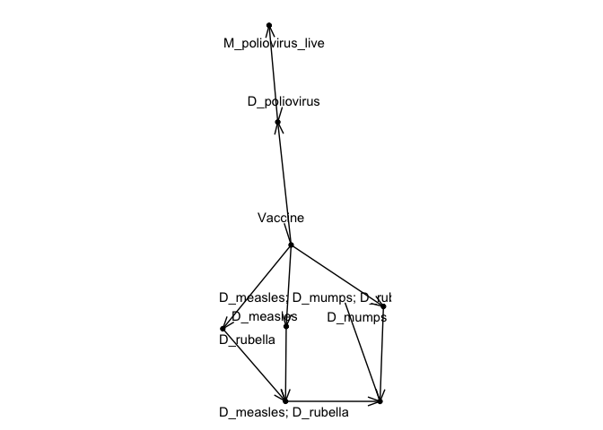

Vaccine concepts in the OMOP CDM Vocabulary lack a comprehensive and
consistent hierarchy. In 2021 the vaccine vocabulary working group
manually constructed a high-level vocabulary hierarchy for vaccine
concepts. However, a manually curated hierarchy is difficult to maintain
and scale up with proper quality control considering the large number
concepts in existing vaccine vocabularies such as RxNorm and RxNorm
Extension. An automated approach is needed to facilitate the creation of
a high-quality and practically useful vocabulary hierarchy. We utilized
Formal Concept Analysis (FCA), a computational method for automatically
creating concept hierarchies rooted in the mathematical theory of
lattices, to build a vaccine vocabulary. The required inputs are simply
the vaccine source codes with the vaccine attributes (e.g., indication,
administration route, and dosing). All nodes/concepts,
linkage/hierarchical relationships between nodes and mappings from
source to standard concepts are generated automatically.

The FCA method requires all vaccine source codes along with their
relevant attributes as input. Given a large number of vaccine source
codes in multiple vocabularies (e.g. CVX, NDC, CPT, and ICD Procedure),
we used a subset of CVX, HCPCS, CPT, and ICD Procedure codes with two
vaccine attributes (indication and mechanism of action) for feasibility
demonstration. An example of the input structure is shown below.

    df <- tibble::tribble(
      ~vacc_id, ~d1,          ~d2,       ~d3,      ~m1, 
      40213190, "poliovirus", NA,        NA,       "poliovirus live",
      40213183, "measles",    "mumps",   "rubella", NA,
      40213168, "measles",    "rubella", NA,        NA,
      40213170, "measles",    NA,        NA,        NA)

    df

    ## # A tibble: 4 × 5
    ##    vacc_id d1         d2      d3      m1             
    ##      <dbl> <chr>      <chr>   <chr>   <chr>          
    ## 1 40213190 poliovirus <NA>    <NA>    poliovirus live
    ## 2 40213183 measles    mumps   rubella <NA>           
    ## 3 40213168 measles    rubella <NA>    <NA>           
    ## 4 40213170 measles    <NA>    <NA>    <NA>

First we create a table with all unique combinations of indication and
mechanism of action in the input. Attributes that are not explicitly
encoded in the decomposition of the input source codes are ignored. Two
source codes with the same set of attributes are considered to be the
same vaccine and mapped to the same concept in the new hierarchy. This
table is known as a “formal context” in Formal Concept Analysis
parlance.

    source("src/R/functions.R")
    ctx <- formal_context(df)

    ## Loading required package: dplyr

    ## 
    ## Attaching package: 'dplyr'

    ## The following objects are masked from 'package:stats':
    ## 
    ##     filter, lag

    ## The following objects are masked from 'package:base':
    ## 
    ##     intersect, setdiff, setequal, union

    ctx

    ## # A tibble: 7 × 6
    ##      id D_measles D_mumps D_rubella D_poliovirus M_poliovirus_live
    ##   <int> <chr>     <chr>   <chr>     <chr>        <chr>            
    ## 1     1 "X"       ""      ""        ""           ""               
    ## 2     2 "X"       "X"     "X"       ""           ""               
    ## 3     3 "X"       ""      "X"       ""           ""               
    ## 4     4 ""        "X"     ""        ""           ""               
    ## 5     5 ""        ""      ""        "X"          "X"              
    ## 6     6 ""        ""      ""        "X"          ""               
    ## 7     7 ""        ""      "X"       ""           ""

Next we use FCA to create the concept and concept\_relationship tables
that define the hierarchical relationships (i.e. ‘Is a’ relationship).

    tbls <- create_concept_tables(ctx)
    tbls

    ## $concept
    ## # A tibble: 9 × 2
    ##      id concept_name                                                  
    ##   <dbl> <chr>                                                         
    ## 1     0 D_measles; D_mumps; D_rubella; D_poliovirus; M_poliovirus_live
    ## 2     1 D_measles; D_mumps; D_rubella                                 
    ## 3     2 D_poliovirus; M_poliovirus_live                               
    ## 4     3 D_measles; D_rubella                                          
    ## 5     4 D_mumps                                                       
    ## 6     5 D_poliovirus                                                  
    ## 7     6 D_measles                                                     
    ## 8     7 D_rubella                                                     
    ## 9     8 Vaccine                                                       
    ## 
    ## $concept_relationship
    ## # A tibble: 11 × 3
    ##     id_1 relationship  id_2
    ##    <dbl> <chr>        <dbl>
    ##  1     0 Is a             1
    ##  2     0 Is a             2
    ##  3     1 Is a             3
    ##  4     1 Is a             4
    ##  5     2 Is a             5
    ##  6     3 Is a             6
    ##  7     3 Is a             7
    ##  8     4 Is a             8
    ##  9     5 Is a             8
    ## 10     6 Is a             8
    ## 11     7 Is a             8

Finally we generate mappings by matching the attribute list of the
sources to the attribute list of the target concepts. Decomposed source
codes will be mapped to the concept that has the exact same set of
attributes.

    maps_to <- create_maps_to(df, tbls$concept)
    maps_to

    ## # A tibble: 4 × 4
    ##    vacc_id target_concept_id source_attribute_set            target_attribute_s…
    ##      <dbl>             <dbl> <chr>                           <chr>              
    ## 1 40213183                 1 D_measles; D_mumps; D_rubella   D_measles; D_mumps…
    ## 2 40213190                 2 D_poliovirus; M_poliovirus_live D_poliovirus; M_po…
    ## 3 40213168                 3 D_measles; D_rubella            D_measles; D_rubel…
    ## 4 40213170                 6 D_measles                       D_measles

The result can be visualized using ggraph. Nodes are uniquely identified
by their set of attributes. Disease/indication level nodes begin with
“D\_” and mechanism level nodes begin with “M\_”.

    ggplot_hierachy(tbls$concept, tbls$concept_relationship)

    ## Loading required package: ggraph

    ## Loading required package: ggplot2

For larger graphs we can use use plotly display node labels only when
the cursor is hovering over a node.

    plotly_hierachy(tbls$concept, tbls$concept_relationship, title = "Example Vaccine Hierarchy")

    ## 
    ## Attaching package: 'tidygraph'

    ## The following object is masked from 'package:stats':
    ## 
    ##     filter

    ## 
    ## Attaching package: 'plotly'

    ## The following object is masked from 'package:ggplot2':
    ## 
    ##     last_plot

    ## The following object is masked from 'package:stats':
    ## 
    ##     filter

    ## The following object is masked from 'package:graphics':
    ## 
    ##     layout

    ## 
    ## Attaching package: 'igraph'

    ## The following object is masked from 'package:plotly':
    ## 
    ##     groups

    ## The following object is masked from 'package:tidygraph':
    ## 
    ##     groups

    ## The following objects are masked from 'package:dplyr':
    ## 
    ##     as_data_frame, groups, union

    ## The following objects are masked from 'package:stats':
    ## 
    ##     decompose, spectrum

    ## The following object is masked from 'package:base':
    ## 
    ##     union

## Additional resources

A complete description of the algorithm using all vaccine source codes
evaluated to date is available in “extras/Algorithm\_walkthrough.Rmd”

A SQL script that attemps to automatically extract the decomposed
attributes from vaccine source codes is available in the
“extras/Decomposition” folder.

The full output that has been generated using this approach to date is
available in the “output” folder.
